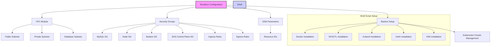

Here is how you can integrate the content of the `infrdiagram.mmd` file into your README file:

```markdown
# Infrastructure Diagram

This repository's infrastructure is visualized using a **Mermaid** diagram. Below is an overview of the infrastructure components and their relationships:



## Diagram Description

1. **Terraform Configuration**:
   - Sets up VPC, Security Groups, and other cloud resources.
   - Includes various modules like public subnets, private subnets, database subnets, and SSM parameters.

2. **Security Groups**:
   - Configured for MySQL, Nodes, Bastion, and EKS Control Plane.
   - Includes Ingress and Egress rules for controlling network traffic.

3. **Shell Script Setup**:
   - Automates the installation of tools on the bastion host:
     - Docker
     - `eksctl`
     - `kubectl`
     - Helm
     - k9s

4. **Kubernetes Cluster Management**:
   - Managed using tools installed on the bastion host.

Use the above diagram as a reference for understanding the infrastructure layout and its dependencies.
